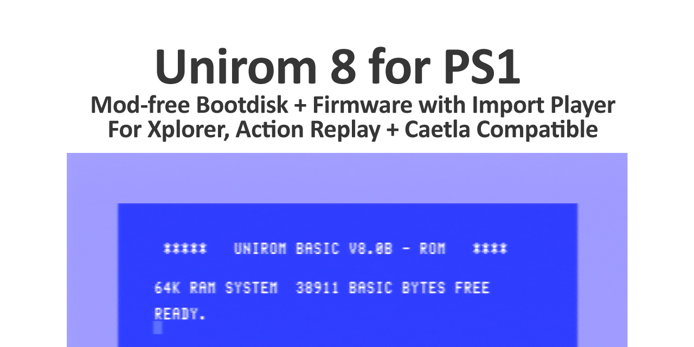

# Unirom 8
	
	Custom Xplorer/Action Replay firmware, bootdisc, import player.
	github.com/JonathanDotCel
		
	Features:
		
		Modchip-free booting
		( nocash unlock or disk swap )
		
		ROM flashing
		( flash from disk or over serial )
		
		Serial upload/download tools
		( +hex editor, open source serial tools, etc )
		
		NTSC->PAL switcher
		( PAL->NTSC is in the works )
		
		Cart Cloning
		( copy to another cart without touching the PC )
		
		XFlash compatibility
		( Can use old XFlash disks )
		
		Caetla SxS
		( Can share a cart with Caetla! )

		Rewritten Completely in C!
		( Much lower bar to entry! )

# Installation

    To install from CD (No PC):
		
		Brief: Burn disk to CD, boot it, use the flash option, flash your cart.
		
        You'll only need the CD one time!
        - Burn \PSX\UNIROM_BOOTDISC_8.x.CUE with ImgBurn. 1x Speed only.
        - Jam your sensor down and do the swap trick to boot the disk if it's not chipped
        ( don't stare at the fucking laser, for fuck's sake don't stare at the fucking laser )
        - Install via CD at the flash menu.
		
        - UNIROM_STANDALONE - just Unirom on the cart
        - UNIROM_WITHCAETLA - Unirom + Caetla on the one cart [ will need something larger than 128k! ]        
        - Done

    To install from another cart already running Unirom 8 (No PC):
		
		Brief: Hotswap carts and copy the contents to another.
		
		Warning: read and fully accept the warning on screen.
		
        Boot with the existing cartridge running
        Select the Clone option
		Unplug it
        Plug the new cart in and flash
        ( You can also boot from one cart, unplug it switch to the other and flash from CD)
    

    To upgrade a cart running Unirom 4,6,7b, or via PSXSerial:
		
        Using nops, temporarily stick the bootdisc version into RAM
        "nops /oldexe unirom_s.exe COM8" (or whatever COM your serial adapter is on via devmgmt.msc)
    
        Now you've got the temporary version, tell it to write to the cart's EEPROM:
		nops /rom unirom_standalone.rom COM8
		OR
		nops /rom unirom_withcaetla.rom COM8
        
    Upgrade a cart already running Unirom8

        nops /rom unirom_standalone.rom COM8
		OR
		nops /rom unirom_withcaetla.rom COM8

    Upgrade a cart running a Unirom7b beta (Never officially released):

        nops /oldrom unirom_standalone.rom COM8

    "Can I use the parallel port?"		
        Unirom 8 *currently* has no PIO support but nopp (notpsxpio) is planned. //TODO
        If you have the Caetla version you can use catflap w/ giveio or whatever over LPT1 though.
		Or load the XFlash CD and send the bootdisc that way, and as before
		
		nops /rom unirom_standalone.rom COM8
		OR
		nops /rom unirom_withcaetla.rom COM8
		

    
    "But what if I'm on linux!"	    
        use mono to launch nops.exe
	
	
    "How does it differ from other firmwares?"

	Caetla and Xplorer support cheats but are closed source.
		
        nocash bios is basically a full replacement + nocash unlock + vcd player (closed source)

        n00bROM has some fun features like exception trapper, planned ROM filesystem, is open source but all MIPS asm.

        Unirom8 is has other stuff like import player, XFlash support, complete serial utility, hex editor, open sourced in C.
		(And can be put on the same cart as Caetla if you still want cheats, etc)
        
		Whatever works for you.
	
	Can I install Unirom alongside <whatever>
	
		Caelta: yes
		XPlorer: possible but not out of the box
		n00bROM: at the time of writing no, but when EXE embedding is ready, yes
		Unirom7: possibly but not out of the box. (no memory collisions)
		NoCash BIOS: no idea!

Troubleshooting!

    Game Not booting? Let me know!
		Console Model/Region
	    Game Region? (PAL/NTSC)
		What boot method?
		What game?
		Did you burn it from one of those horrible .ECM disks?
		Does it work from the normal Boot or disc swap?
		Is the disc clean?
		But, like... did you *really* check

	Cartridge unrecognised?
	    Take it apart and let me see the chips!

	Other?
	    Find me on discord, psxdev.net, github, etc.
	    

Building the source:

    Build setup.
    
        Grab the version of PSQY from PSXDev
		
        Install to c:\psyq\
        Put UniROM in c:\psyq\urom\

        That's really non-negotiable btw.
        The build system is not functional on 64bit machines and I'm not chasing a 
		moving target (e.g. LameGuy64 has a nice modern SDK, but it's not finished)		
        So c:\psyq\urom\ is hard coded until further notice.
		If you try to change it, you're going to have a miserable time.

		See the main.c header for much more info.
		
		"What if I'm on Linux?"
		    You made your bed, lie in it. WINE or crossover or some buggy shit like that.

    To build the bootisc / .exe
    
		Brief:
			Just a little solo .exe version of UniROM.
			It doesn't need to be on a cart, you can use it to boot stuff, you can run it from disk
			you can test it on emulators, you can do whatever. All good.
		
		Instructions:		
			build_bootdisc.bat
			which creates "unirom_s.exe"
		
		
    To build the .rom
    
		Brief:
			This is the one that goes on the cart.
			It's a compressed .exe which the .rom decompresses into memory.
    
		Instructions:
			
			build_inrom.bat
				creates unirom_r.exe and the compressed version unirom_r.crunch
				the rom will decompress this from the cartridge into ram at runtime
		
			THEN:
			
			build_roms.bat
				creates the rom using unirom_r.crunch:
				unirom_standalone.rom
				unirom_withcaetla.rom
        
		That's it, just the inrom exe then the rom to put it in.
        
		
    Note:
        The _bootdisc and _inrom versions load to different addresses and can both be in mem at the same time
        So it is possible to work on the .exe by sending nops /exe unirom_s.exe COM8 to the rom without
        having to flash all the time. (See the individual .lnk files for specific addresses)

	Note:
		"Why does the .exe not run from the cart?"
		- Don't need to know your C-code entry point
		- Can compress the .exe
		- Linker .bss and .sbss sections don't need explicit declarations
		- IDA will not automatically label functions with a custom crt0/crt1/startup.s
		- Flashing the ROM while executing from it is a pain
		- There's the odd issue with execution from ROM
		

Folder structure:
	
    rom_* = Belongs to the ROM portion, which unpacks the main UniROM_R.exe into RAM
    exe_* = Belongs to either unirom_r.exe or unirom_s.exe - the version unpacked from the rom or the version on the bootdisc
    asm_* = assemblies shared by both parts. E.g. CD functions are used by the .exe files AND the ROM

	The ROM headers:
	    
        rom_standalone.asm - Build this for Unirom 8 on its own
        rom_withcaetla.asm - Build this for Unirom 8 with Caetla
			
			both will then include rom_shared.asm after that and are the same from there on in.
			( See above for build procedure );

Credits, thanks & kidney donors in no particular order:
    
    ( Give me a nudge to get your github repo or dl page next to your name )
	

char *credits[] = { 
	"", "", "",
	"Doofy", "Nocash <3", "Shendo", "Type 79", "Dax", "Jihad / Hitmen", "Silpheed / Hitmen", "SquareSoft74 (no spaces)" ,
	"Foo Chen Hon", "Shadow / PSXDev", "Matthew Read (lol)", "DanHans / GlitterGirls", "Herben", "and asmblur", "JMiller", 
	"Tim S / Firefly", 	"rama (any version)",
	"Padua", "Blackbag", "Napalm", "Paradox / Paradogs :p", "XPlorer Peeps", "K-Comms Peeps",
	"noisy assholes who recycle...", ".. bottles, one by fucking...", "... one",
	"barog", "L0ser", "cybdyn", "paul", "Peter Lemon", "and krom", "Brian Marshall", "Mistamotiel", "and Mistamontiel...", "tieigo", "orion",
	"Codeman", "Cat", "LordBlitter", "SurfSmurf", "kHn", "Nicolas Noble", "r0r0",
	"Everyone at PSXDev!", 
	"Tetley.co.uk", "And absolutely *not*...", "Lameguy64", "lol"	// lol just fucking about, he's helped loads
	// And an extra special thanks to SquareSoft74, DanHans and Nicolas Noble who've been absolute fucking legends with their support and advice!
};

DISCLAIMER:
    
    NEITHER I NOR ANYONE INVOLVED IN THE UNIROM PROJECT IS RESPONSIBLE FOR YOUR NEGLIGENCE, LACK OF RESEARCH, LACK OF KNOWLEDGE, OR ACTIONS
	BROKEN PSX = YOUR FAULT, SHOULD'VE RESEARCHED IT BETTER
	GONE BLIND = SHOULD NOT HAVE LOOKED AT THE FUCKING LASER
	

Well wishes:
	
	Writing this has kept me sane through more than 6 weeks of Covid 19 symptoms and lockdown.
	So cheers to everyone doing their bit.
	
	Stay safe, wash your hands and protect the NHS, your loved ones, etc.
	Remember road traffic accidents and tobacco deaths aren't contagious but stupidity and Corona Virus are.
	No point being a contrarian just for the fucking sake of it.

Changelog:

8.0.b2 - Exit menu, UI tweaks, FastLoad, etc.
	
	- AMD AM29F010 support (0x01,0x20)
	- Switched boot to R1
	- Added L1 for FastLoad option
	- Checksum for Jumping Flash (USA) to force fastboot	
	- Fixed a visual dual-bank glitch
	- Roms are now numbered 1->whatever instead of 0->whatver-1
	- Disabled entry point 0x1F000000 to allow BIOS booting
	- Exit menu!
	- Little pulse on the menu highlight
	- Removed CDROM status (was causing issues)
	- Fixed an issue with the chip detect locking up writing
	- fixed some volatile/nonvolatile consistency	
	- Switched u_long to a defined ulong so visual studio calms down.
	- More detailed info for XFX 3rd Gen detection
	- Selected ROM size now shown on the rom loader screen
	- Added Sanyo LE28C1001 EEPROM support	
	- The switch works!
	- Added Squaresoft74's ROM collection to factory restore your cart
	- Restored support for titles:
        -Syphon Filter 1-3
	    -Battle Arena Toshinden (via boot disc)
	    -Parasite Eve 1
	    -THPS3 (yaaaas)
	    -Critical Depth
	- Fixed broken SIO commands and restored BOOT over SIO	
	- Fixed a bunch of credits (like so many)
	- Switched the FastLoad list to an actual list format	
	- set up a single define for uint, ushort, uchar, etc
	- now reads unirom_s.rom and unirom_w.rom from the disc directly
	- removed dosbox from the tools dir (using Orion's cpe2x.exe)
	- status menu now reports EEPROM size
	- rom override function - can attempt write by holding R4 + Star
	- added a watch mode to NoPS
	- Switched over to Lameguy's mkpsxiso for for quicker iso builds

8.0.b3	- Internal

8.0.b4 - Stuff and/or things.
	
	Features:
	- 500k serial transfers (Square or add /fast in NoPS)
	- TTY->SIO redirects to see ingame printfs
	- Big compatibility fixes
	- Caetla patched for auto PAL/NTSC

	Experimental:	
	- Upload/Download during gameplay (L1+Square or /debug in NoPS)
	- PAL -> NTSC

	Minor:	
	- Auto reset after EPPROM programming
	- Auto start when safe loading discs
	- Hex editor names regions properly		
	- Removed LIBSIO / LIBGS to save a few KB
	- Fixed Hex Editor (R1) button	
	- Changed "Boot" to "Play" on 2nd menu
	- Tidied a *ton* of source for release	
	- Converted a bunch of sys calls over to C
	- Discs with only a PSX.EXE no longer require button press
	- Tidied many function names
	- Leaner/Cleaner hook functions (GPU, switch, etc)
	- Linux support over in NoPS (thanks r0r0!)
	- Fixed the flickery status screen	
	- Switched flash code over to KSEG1 (thanks Nicolas!)
	- Switched boot method to boost compatibility
	- Switched that to an access hook... lol
	- Credited Squaresoft74 in the bonus roms menu
	- Renamed Bonus Roms to rom restoration
	- Converted more assembly over to C
	- Loads of new NoPS stuff

8.0.b5 - Compat Tweaks!
	
	- Fixed CD loading issues introduced in b4
	- Loads more juicy SIO debug info
	- Fixed NTSC->PAL support on
	  - Metal Gear Solid
	  - Dave Mirra BMX games
	  - Tony Hawk's Pro Skater 3
	  - Alone in the Dark
	  - Destruction Derby 2	  
	  - The Hooters driving game
	  - Excalibur225
	  - Some Hello Kitty game	  
	- Tidied the linker files
	- Tidied a bunch of code

TODO:				
	- Investigate Xploder PRO (Germany) r3.3 petitPRO 1999-08-31 [!]
	

SOURCE TODO:
	- a bunch more reformatting
	- cd flush regs consts
	- remove like so many nops
	
