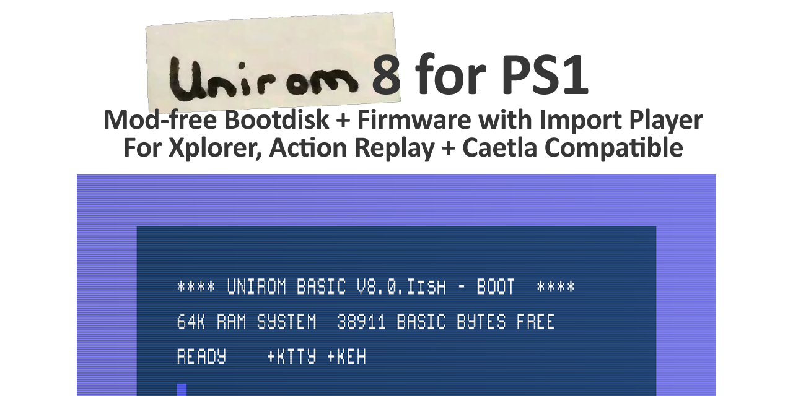

# Unirom 8
	
	Custom Xplorer/Action Replay firmware, bootdisc, import player.
    
	Discord: http://psx.dev
    Twitter: twitter.com/jonathandotcel

# Features:

- Mod-free booting via nocash unlock or disk swap
- Install to cheat cart (Action Replay/XPlorer, etc)
- or Memory card via FreePSXBoot (included on the CD)
- PAL->NTSC and NTSC->PAL soft patching (play imports in colour)
- Memory card manager
- File browser
- ROM backup to/from memory card
- Launch homebrew from memory card
- Huge backup ROM set (thanks Squaresoft74 & kHn!)
- Dualboot with Caetla
- Serial upload/download tools
- Kernel-resident SIO (debug games)
- Exception handler, Hex editor, Card Editor, etc
- XFlash compatibility

# Installation
		
    Everything you need to get started is here:
    e.g. burn it to CD and install it to card or memory card via FreePSXBoot
    https://unirom.github.io/

# Developers:

    Developer Discord:
    https://psx.dev

    NoPS for serial transfer to/from PC:
    https://github.com/JonathanDotCel/NOTPSXSerial

    FreePSXBoot:
    https://github.com/brad-lin/FreePSXBoot

# Troubleshooting!

    Game Not booting? Let me know!
		Console Model/Region
	    Game Region? (PAL/NTSC)
		What boot method?
		What game?
		Did you burn it from one of those horrible .ECM disks?
		Does it work from the normal Boot or disc swap?
		Is the disc clean?
		But, like... did you *really* check

	Cartridge unrecognised?
	    Take it apart and let me see the chips!

	Other?
	    Find me on discord, psxdev.net, github, etc.
	    

# Building the source:

    As of 8.0.K the source is being prepped for release!

# Changelog:

8.0.b2 - Exit menu, UI tweaks, FastLoad, etc.
	
	- AMD AM29F010 support (0x01,0x20)
	- Switched boot to R1
	- Added L1 for FastLoad option
	- Checksum for Jumping Flash (USA) to force fastboot	
	- Fixed a visual dual-bank glitch
	- Roms are now numbered 1->whatever instead of 0->whatver-1
	- Disabled entry point 0x1F000000 to allow BIOS booting
	- Exit menu!
	- Little pulse on the menu highlight
	- Removed CDROM status (was causing issues)
	- Fixed an issue with the chip detect locking up writing
	- fixed some volatile/nonvolatile consistency	
	- Switched u_long to a defined ulong so visual studio calms down.
	- More detailed info for XFX 3rd Gen detection
	- Selected ROM size now shown on the rom loader screen
	- Added Sanyo LE28C1001 EEPROM support	
	- The switch works!
	- Added Squaresoft74's ROM collection to factory restore your cart
	- Restored support for titles:
        -Syphon Filter 1-3
	    -Battle Arena Toshinden (via boot disc)
	    -Parasite Eve 1
	    -THPS3 (yaaaas)
	    -Critical Depth
	- Fixed broken SIO commands and restored BOOT over SIO	
	- Fixed a bunch of credits (like so many)
	- Switched the FastLoad list to an actual list format	
	- set up a single define for uint, ushort, uchar, etc
	- now reads unirom_s.rom and unirom_w.rom from the disc directly
	- removed dosbox from the tools dir (using Orion's cpe2x.exe)
	- status menu now reports EEPROM size
	- rom override function - can attempt write by holding R4 + Star
	- added a watch mode to NoPS
	- Switched over to Lameguy's mkpsxiso for for quicker iso builds

8.0.b3	- Internal

8.0.b4 - Stuff and/or things.
	
	Features:
	- 500k serial transfers (Square or add /fast in NoPS)
	- TTY->SIO redirects to see ingame printfs
	- Big compatibility fixes
	- Caetla patched for auto PAL/NTSC

	Experimental:	
	- Upload/Download during gameplay (L1+Square or /debug in NoPS)
	- PAL -> NTSC

	Minor:	
	- Auto reset after EPPROM programming
	- Auto start when safe loading discs
	- Hex editor names regions properly		
	- Removed LIBSIO / LIBGS to save a few KB
	- Fixed Hex Editor (R1) button	
	- Changed "Boot" to "Play" on 2nd menu
	- Tidied a *ton* of source for release	
	- Converted a bunch of sys calls over to C
	- Discs with only a PSX.EXE no longer require button press
	- Tidied many function names
	- Leaner/Cleaner hook functions (GPU, switch, etc)
	- Linux support over in NoPS (thanks r0r0!)
	- Fixed the flickery status screen	
	- Switched flash code over to KSEG1 (thanks Nicolas!)
	- Switched boot method to boost compatibility
	- Switched that to an access hook... lol
	- Credited Squaresoft74 in the bonus roms menu
	- Renamed Bonus Roms to rom restoration
	- Converted more assembly over to C
	- Loads of new NoPS stuff

8.0.b5 - Compat Tweaks!
	
	- Fixed CD loading issues introduced in b4
	- Loads more juicy SIO debug info
	- Fixed NTSC->PAL support on
	  - Metal Gear Solid
	  - Dave Mirra BMX games
	  - Tony Hawk's Pro Skater 3
	  - Alone in the Dark
	  - Destruction Derby 2	  
	  - The Hooters driving game
	  - Excalibur225
	  - Some Hello Kitty game	  
	- Tidied the linker files
	- Tidied a bunch of code

8.0.b6 - "Minty"
	
	Notable Changes:
	- Custom GPU, CD and Joypad libs.
	- Lightweight, high-compatibility game loader	
	- Improved TTY->SIO (more output)
	- Clearer instructions w/ buton combos
	- Sexy new font, and toned down colours
	- SIO spam on load to help users set up

	Debug Core: (In Progress)
	- You can now use the debug core to keep serial
	  enabled as you load games or develop homebrew.
	  Do "nops /debug"
	  Then the regular NoPS stuff like /exe /dump, etc
	- Added /exe upload to (in progress) debug core
	- Added /fast (518400 baud) support to debug core
  
	Minor Tweaks:	
	- Fixed fastbook hooking write and not exec		
	- Fixed a boot delay (Thanks Rama)
	- Fixed "Burn at 1x" which was annoying Shadow
	- Detect + Warn on locked NTSC-J
	- Fixed jumbled pixels on repeated lines
	- Fixed a bunch of missing chars
	- .Exe loading debug @ 0x1F800200
	
	Compatibility Fixes:
	- 40 winks
	- CTR
	- Harmful Park	
	- N20
	- Rayman 2
	- Rapid Reload	
	- Toushinden (Toshinden 4)

8.0.b7 - This update was unlisted.

8.0.b7 EX Alpha Turbo
	
	This is a stopgap build fixing some small things before the next major release.

	- Removed a wee delay when loading CDs
	- Tweaked a bunch of CD functions
	- Baud rate fixes for high speed SIO	  
	- Fixed a confirmed checksum collision during sio upload (ty Nicolas!)
	
8.0.b7 - 8.0.bB - CD File Browser for ROM/EXE + Basic Hex Preview + Fixes

	Recent version summary:
	- Fixed "Not a double-chip cart"
	- Fixed a misidentification of one particular cart
	- Added CD file browser (Memcard coming)
	- Added a proper dollar to the font
	- Fixed an off-by-one error loading an extra sector on the file browser
	- A few tiny tweaks to clean up this release.
	- Skipped a few versions because 80bB looks fun.

8.0.C

	Big update!
	- Exception Handler
	- Self correcting SIO protocol
	- AR/GS V2 support (with gap)	
	- PAR3, XP, etc detection + support
	- New CD routines	
	- CartDetector + manual cart definition

	Huge thanks to Nicolas Noble for helping with so much, to Squaresoft74 for testing and advice and to Danhans42 for the music he shared with the world (plus some pointers on cart detection techniques).

	Complete:
	- Fixed some accidental double-bytes in the hex editor
	- new CD boot routine using file browser
	- exception handler
	- nicolas tidied a ton of things up
	- rewrote the TTY redirect in C
	- moved IsROM over to the makefile/linker
	- Tri+ Left/Right/Up/Down for a quick increment in the hex editor
	- converted ex handler to C
	- opened up various parts of the memory map to writing
	- made CD drive properly wait	
	- Auto cart detection
	- Datel V2/V3 support
	- Credit for krHACKen / kHn	
	- W29EE011 support
	- SST 39SF020 support
	- SST 39VF040 support
	
		
8.0.D

    Incremental update - mostly developer/SIO focused.
    (Implementing step by step GDB debugging)

    Summary:
    - new NoPS user guide: (https://github.com/JonathanDotCel/NOTPSXSerial)
    - /poke8, /poke16 and /poke32 commands
    - /halt and /cont commands
    - /regs and /setreg commands
    - /hookread, /hookwrite, /hookexec cop0 breakpoints (SIO /debug)
    - /exe now works in kernel debug mode
    - /dump got the V2 protocol stability fixes.
    - exception handler waits for SIO if kernel /debug running            
    - improved boot sequence, thanks Rama!

    Complete:
    - properly applying licenses
    - Poke8, Poke16 and Poke32 commands in nops
    - great new pads code, with optional key repeat
    - random bugfixes here and there
    - exception handler now pauses if in debug mode
    - some kernel debug updates
    - screen blanking before starting a game (Ace Combat 2)
    - smushed ISO layout around a bit for future xStation support
    - halt + continue support
    - simple cop0 breakpoints
    - switched CD ReadS to ReadN (thanks Rama)
    - hookread, hookwrite and hookexec functions
    - upgraded the /dump function to V2 protocol (kernel + usernmode sio)
    - can now upload /exe in kernel debug mode

8.0.Eish

    - Memcard Manager
    - Memcard dumping/restoration (from nops)
    - Memcard Pro support
    - FreePSXBoot installer + Unirom Lite (thanks Bradlin & Nicolas)
    - Write memcard images from CD
    - More ROM restoration options (thanks Squaresoft74)
    - Text colours + navigation improvements
    - SST EEPROM Fixes (Thanks Schnappy)
    - AM29F010 should be usable after type detection (Thanks kHn)
    - Support for Negcon etc 
    - /slow added to return to 115200 baud (kernel and usermode sio)
    - /watch memory dump works in kernel debug sio    
    - .exes may return execution to unirom (thanks Nicolas)
    - Updated credits    
    - Brook Adapter fixes (Thanks MCPro Team!)
    - Name buffer size issue
    - TCP/SIO bridge for nops
    - Rewritten nops documentation (especially debugging)
    - Added Dan's Pong game for a nops sample :)
    - nops will stop you accidentally flashing an .exe to ROM (thanks Skitchin)

8.0.Fish

    - MCPro Channel/Card controls
    - Can now properly delete (format) FreePSXBoot cards
    - BIOS CRC32 from the status screen (Thanks Nicolas!)
    - Added Dan's pong to the CD! (Easter egg? :p)
    - Added the Datel V2 (gapped) ROM to the release .zip
    - Fixed the hex editor address entry
    - Fixed a bug when auto-listing CD directories
    - Clearer memcard overwrite warning
    - Fixed an anomalous "format failed" message.
    - Added "Format" to memcard context menu
    - Fixed a missing credit for Skitchin

8.0.G

    - New FreePSXBoot installer screen with QR codes (ty for the idea Nicolas)
    - Sends UNIROM to MCPro on startup to hold savedata (in the works)
    - Memcard images are verified when written
    - Nops will correctly dump REGS when it detects a crash
    - Updated the credits a bit
    - Tidied up menus a bit (footers, specifying which disc)    
    - Warning for 1k 2-card models using FreePSXBoot
    - Tidied up some more menus, made them cancellable
    - Fixed broken SIO flashing
    - Fixed status menu "CD Unlocked"
    - Moved +MBH, +MC to the status menu
    - Tidied up the Install screen
    - Updated Danhans' pong!
    - Fixed a graphical bug in the memcard manager
    - Put nops.exe back in the release folder :)

8.0.H

    - Fixed a pointer issue on the FreePSXBoot installer page.
    
8.0.I

    - Can now leave FreePSXBoot card in slot 2! (thanks Bradlin)
    - .ELF upload support
    - PCDRV support
    - Able to upload nugget/psyq .exes over themselves.
    - Fixes bugs in Crisis Beat and Elemental Gearbolt (thanks Nicolas)
    - Includes Shendo's PS1CardLink (thanks Shendo)
    - New rom sets! (thanks Squaresoft74 and kHn)

8.0.J

    Features:
    - Settings menu/saving + Autoboot
    - Disc identify routine    
    - Scam memcard detection (512k)
    - Memcard Hex Editor
    - Much faster booting (usually)
    - Sped up the card screen a bit (ty rama)
    - New documentation! 
      unirom.github.io  (ty nicolas!)
    - FreePSXBoot from slot 2 (properly!)
    - Updated ROMsets (ty Squaresoft74!)
    Fixes:
    - Fixed memcard screen rebooting
    - Hid memcard debug behind L1+R1    
    - Progress bars on the memcard screen
    - Fixed a missing SJIS entry (ty nicolas)    
    - MCPro stability fixes (ty rama)
    - Card format option for the memcard screen
    - Nops: specify dump filenames (ty T0fuZ!)    
    - Nops: can now type into the monitor    
    - Support for lots of cheap memcards: 
      Wicareyo, Zedlabz/Assecure, Kafuty,
      Ruitroliker, GamerGear, etc
    - Fixed card screen visual glitches
    - "Partial Deleted Save" on memcard screen
    - Updated 28FS040
    - Popup menu colour fix
    - Warning when flashing with no card inserted
    - Fixed booting of several games
    - Fix from J-ish to allow editing empty cards
    - Indicates which card slot it was booted from    
    Boot Fixes:
    - Fix: BattleTanx 2 (mistamontiel)
    - Fix: Heaven's Gate SLPS-00667 (mistamontiel)
    - Fix: Crisis Beat (rama)

8.0.K

    - GDB debugging via nops/vscode/etc (Thanks Skitchin)
    - New ROMs including Tonyhax & nocash bios on the CD
      (Thanks to Squaresoft74, no$, MottZilla & TonyHax peeps!)
    - Can install FreePSXboot on 64k scam memory cards
    - Can launch homebrew from memory card (tool included)
    - Flash ROMs from memcard
    - Backup ROMs to memcard
    - Tetris game (to replace flappycredits)
    - Switch to Caetla 0.38 by default
    - Longer wait to fix MCPro boot issues
    - Ability to change the 2nd rom, relabel it, etc (see unirom.github.io)
    - Static entry point at 0x1F000140 (or 0x1F020140)
    - Fixed a ton of TTY spam on e.g. Need For Speed (thanks Rama!)
    - Fixed an issue detecting dual-EEPROM carts introduced in 8.0.J (thanks Square!)
    - Added an unhook option in uni & nops
    - Fixed /jmp not working in kernel debug mode
    - Fixed /cont not working properly when triggered by a `break` instruction
    - Switched to faster DMA-based CD access (thanks Nicolas & Rama)
    - Fixed a hook mask issue (Thanks Skitchin)
    - Beefed up memcard write verification a bit
    - [nops] `nops /gaps` and `nops /flat` to force datel V2 cart mode on/off
    - [nops] Longer timeout in sio for shitty wifi connections (thanks Skitchin)
    - Bishi Bashi working (PAL/NTSC-J)
    - Kings field working (NTSC/NTSC-J)!
    - Gundam 2 working (NTSC)
    - Rayman 2 Working (NTSC)
    - Rayman 1 broken :o!

    TODO:
    - Default video mode setting
    - X or O for confirm setting
    - Check if the getC0table patch is required for the debugmode stuff to actually work?
    - use the syscall for critical sections
    - SetSessionSuperUltraCommandSmash()
        
    Roadmap:
    - open source everything
    - Setsession on disc swap
    - Cheats
    - Finish implementing DMA-based CD stuff
    - make 573 bootable via psx.exe
